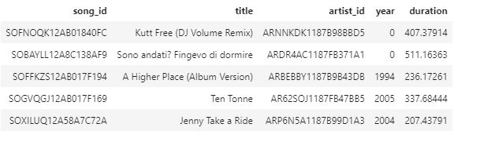
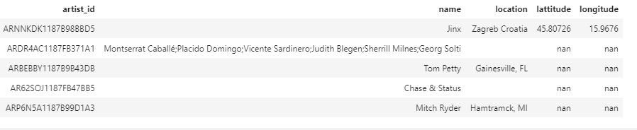
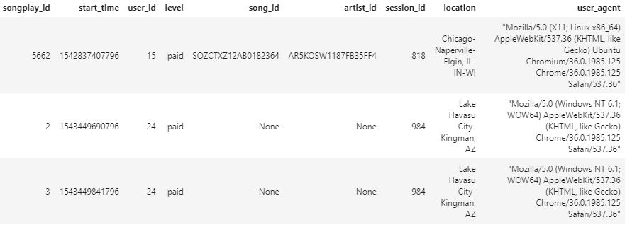

## Requirements
===============

1. pandas
2. psycopg2
3. sql_queries

## Project Brief
================

Let's consider an imaginary music streaming company, lets call them Sparkify. We are interested in understanding what songs users are listening to, this is an analytical goal

## Dataset Justification
========================

To find what songs users are listening to, we need songs that sparkify hosts, and the event data of user interaction on the app. With this we could at anytime at a specified timestamp find what any user is listening to.

## Schema Justification
=======================

To achieve our analytical goal we need multiple dimension table with information like users,songs,artists,time and a fact table to merge contents of those tables. This in essence is a star schema.

1. Fact Table

    songplays - Records in log data associated with song plays

            songplay_id, start_time, user_id, level, song_id, artist_id, session_id, location, user_agent

2. Dimension Tables

    users - Users in the app

            user_id, first_name, last_name, gender, level

    songs - songs in music database

            song_id, title, artist_id, year, duration

    artists - artists in music database

            artist_id, name, location, lattitude, longitude

    time - timestamps of records in songplays broken down into specific units

            start_time, hour, day, week, month, year, weekday

## Dataset Cleansing Process and ETL
====================================
Procedure for each table is discussed below:

1. song table, artist table, user table:
    1. Read appropriate log files with pandas.
    2. Extract required contents to dataframe.
    3. Insert dataframe to respective table.

2. time_table table:
    1. Convert timestamp to pandas date_time.
    2. Extract appropriate contents of date_time using dt atributes to dataframe.
    3. Insert dataframe into table.
3. songplay table:
    1. Implement a query (`song_select`) to find the song ID and artist ID based on the title, artist name, and duration of a song.
    2. Select the timestamp, user ID, level, song ID, artist ID, session ID, location, and user agent and set to `songplay_table_insert`

## Project Steps
================
### Below are steps you can follow to complete the project:

1. Run create_tables.py to create your database and tables and drop if it is already present
2. Run etl.py to extract and insert the data into appropriate tables
3. Check table values with following queries:

        SELECT * FROM songs LIMIT 5;
        

        
        SELECT * FROM artists LIMIT 5;
        

And finally check songplays table
      
        SELECT * FROM songplays ORDER BY song_id LIMIT 3;
        

